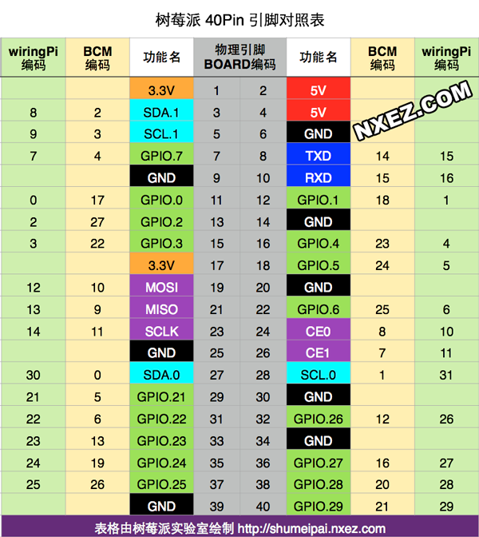

# 可用工程库
## ->SSD1306 Clock
工程：**raspberrypi_oled_clock**

**注意:** 

1. `fonts`是目前的字库，`1206`，`1608`是完整的ASCII码表，`1616`，`3216`目前只有数字。没有汉字码表。
2. 没有使用`wiringPi`库，而是使用了标准的`linux I2C`驱动: `ioctl`. 
3. 可以画位图。

```
gcc main.c ssd1306.c fonts.c  -o oled
```

## ->DHT11+OLED
工程：**dht_oled**

**注意:** 

1. `fonts`是目前的字库，`1206`，`1608`是完整的ASCII码表，`1616`，`3216`目前只有数字。没有汉字码表。
2. 没有使用`wiringPi`库，而是使用了标准的`linux I2C`驱动: `ioctl`. 
3. 可以画位图。

```
gcc main.c ssd1306.c fonts.c  dht11.c  -lwiringPi -o oled
```


## wiringPi库

1. wiringPi的管脚定义参见下图：



2. 可以配合`i2cdetect`工具检测/调试`i2c`总线上的设备

> ref:[树莓派4b的i2c配置及wiringPi通信 - 灰信网（软件开发博客聚合） (freesion.com)](https://www.freesion.com/article/6747174458/)
>

通过`i2cdetect -l`指令可以查看树莓派上的`I2C`总线，从返回的结果来看树莓派含有两个`I2C`总线，通过阅读相关的资料，树莓派1代使用`I2C0`，而树莓派2代使用`I2C1`。

若总线上挂载`I2C`从设备，可通过`i2cdetect`扫描某个`I2C`总线上的所有设备。

```bash
pi@raspberrypi:~/Downloads/RaspberryPi/rasp_pi/pcf8563 $  i2cdetect -l
i2c-1   i2c             bcm2835 (i2c@7e804000)                  I2C adapter
pi@raspberrypi:~/Downloads/RaspberryPi/rasp_pi/pcf8563 $ i2cdetect -y 1
     0  1  2  3  4  5  6  7  8  9  a  b  c  d  e  f
00:          -- -- -- -- -- -- -- -- -- -- -- -- -- 
10: -- -- -- -- -- -- -- -- -- -- -- -- -- -- -- -- 
20: -- -- -- -- -- -- -- -- -- -- -- -- -- -- -- -- 
30: -- -- -- -- -- -- -- -- -- -- -- -- 3c -- -- -- 
40: -- -- -- -- -- -- -- -- -- -- -- -- -- -- -- -- 
50: -- 51 -- -- -- -- -- -- -- -- -- -- -- -- -- -- 
60: -- -- -- -- -- -- -- -- -- -- -- -- -- -- -- -- 
70: -- -- -- -- -- -- -- --                         
```


### ->DHT11纯驱动库

工程：**dht11**

读取`dht11`中的时分秒，并打印

```bash
pi@raspberrypi:~/Downloads/RaspberryPi/rasp_pi/dht11 $ gcc dht11.c -o dht -lwiringPi
pi@raspberrypi:~/Downloads/RaspberryPi/rasp_pi/dht11 $ ./dht 
Try 500 time
Check sum error
Try 499 time
Humi:30 %,TEMP:25 *C
Try 498 time
Humi:30 %,TEMP:25 *C
```

### ->pcf8563
工程：**pcf8563**

读取`pcf`中的时分秒，并打印

```
pi@raspberrypi:~/Downloads/RaspberryPi/rasp_pi/pcf8563 $ gcc pcf.c -o pcf -lwiringPi
pi@raspberrypi:~/Downloads/RaspberryPi/rasp_pi/pcf8563 $ ./pcf 
i2c setup successful 3
Current Time is 2:40:94
Current Time is 2:40:95
Current Time is 2:40:96
```

### ->led
工程：**led**

使用`wiringPi`库来控制LED的亮灭。`27-blue`，`28-green`，`29-red`

编译指令如下：

```
gcc led_blink.c -o led_blink -lwiringPi
```


## ->MQTT
## 工程：**paho.mqtt.embedded-c**

> ref: [(48条消息) Paho MQTT 嵌入式c客户端研究笔记_读书未遍、未敢妄下雌黄-CSDN博客_paho.mqtt.embedded-c-master](https://blog.csdn.net/rambomatrix/article/details/62892151)
>
> [(48条消息) paho.mqtt.c简单介绍_霍宏鹏的专栏-CSDN博客_paho.mqtt.c](https://blog.csdn.net/huohongpeng/article/details/118381853)

1. 主要使用了文件夹`paho.mqtt.embedded-c\MQTTPacket`这个C库

   *MQTTPacket*目录包含需求最小的最低级别C库。这提供了简单的序列化和反序列化例程。它们作为高级库的基础，但也可以单独使用。

2. 测试用例可参考上述文件夹中的`sample`，`paho.mqtt.embedded-c\MQTTPacket\samples\pub0sub1.c`，目前已修改为可以订阅一个`topic`，并且使用该`topic`发送`payload`.

3. 使用`test.mosquitto.org`作为`MQTT broker`

4. 编译指令参考

   `RaspberryPi\rasp_pi\paho.mqtt.embedded-c\MQTTPacket\samples\build`

   编译命令路径和基本运行日志如下：

```bash
pi@raspberrypi:~/Downloads/RaspberryPi/rasp_pi/paho.mqtt.embedded-c/MQTTPacket/samples $ gcc -Wall -c transport.c -Os -s
pi@raspberrypi:~/Downloads/RaspberryPi/rasp_pi/paho.mqtt.embedded-c/MQTTPacket/samples $ gcc pub0sub1.c transport.o -I ../src ../src/MQTTConnectClient.c ../src/MQTTSerializePublish.c ../src/MQTTPacket.c ../src/MQTTSubscribeClient.c -o pub0sub1 ../src/MQTTDeserializePublish.c -Os -s ../src/MQTTConnectServer.c ../src/MQTTSubscribeServer.c ../src/MQTTUnsubscribeServer.c ../src/MQTTUnsubscribeClient.c -ggdb
pi@raspberrypi:~/Downloads/RaspberryPi/rasp_pi/paho.mqtt.embedded-c/MQTTPacket/samples $ ls
baremetalserial  build  CMakeLists.txt  null.c  ping.c  ping_nb.c  pub0sub1  pub0sub1.c  pub0sub1_nb.c  qos0pub.c  transport.c  transport.h  transport.o
pi@raspberrypi:~/Downloads/RaspberryPi/rasp_pi/paho.mqtt.embedded-c/MQTTPacket/samples $ ./pub0sub1 
Sending to hostname test.mosquitto.org port 1883
publishing sending
message arrived payload 0
publishing sending
message arrived payload 1
publishing sending
message arrived payload 2
publishing sending
message arrived payload 3
publishing sending
message arrived payload 4
publishing sending
message arrived payload 5
......
^Cpublishing sending
disconnecting
```


## onenet-MQTT测试用例

1. 先编译**paho-mqtt3c**库.

   **paho-mqtt3c** ：同步API接口的库，API函数都是以MQTTClient开头，API函数定义在MQTTClient.h。

   在`RaspberryPi\rasp_pi\paho.mqtt.embedded-c`路径下，直接运行`make`，得到

```bash
pi@raspberrypi:~/Downloads/RaspberryPi/rasp_pi/paho.mqtt.embedded-c $ make
mkdir -p build/output/samples
mkdir -p build/output/test
cc -g -fPIC -Os -Wall -fvisibility=hidden -DLINUX_SO -o build/output/libpaho-embed-mqtt3c.so.1.0 MQTTPacket/src/*.c -shared -Wl,-soname,libpaho-embed-mqtt3c.so.1
ln -s libpaho-embed-mqtt3c.so.1.0  build/output/libpaho-embed-mqtt3c.so.1
ln -s libpaho-embed-mqtt3c.so.1 build/output/libpaho-embed-mqtt3c.so
cc -o build/output/samples/pub0sub1 MQTTPacket/src/../samples/pub0sub1.c MQTTPacket/src/../samples/transport.o -lpaho-embed-mqtt3c -I MQTTPacket/src  -L build/output
cc -o build/output/samples/qos0pub MQTTPacket/src/../samples/qos0pub.c MQTTPacket/src/../samples/transport.o -lpaho-embed-mqtt3c -I MQTTPacket/src  -L build/output
cc -g -o build/output/test/test1 MQTTPacket/src/../test/test1.c -lpaho-embed-mqtt3c -I MQTTPacket/src  -L build/output
pi@raspberrypi:~/Downloads/RaspberryPi/rasp_pi/paho.mqtt.embedded-c $ ls build/output/
libpaho-embed-mqtt3c.so  libpaho-embed-mqtt3c.so.1  libpaho-embed-mqtt3c.so.1.0  samples  test
```

2. 将三个`*.so`文件, `copy`到`/lib`目录下.

```bash
pi@raspberrypi:~/Downloads/RaspberryPi/rasp_pi/MQTTPacket-onenet-dht-thread $ sudo cp ../../paho.mqtt.embedded-c/build/output/libpaho-embed-mqtt3c.so /lib
pi@raspberrypi:~/Downloads/RaspberryPi/rasp_pi/MQTTPacket-onenet-dht-thread $ cp ../../paho.mqtt.embedded-c/build/output/libpaho-embed-mqtt3c.so.1 /lib
pi@raspberrypi:~/Downloads/RaspberryPi/rasp_pi/MQTTPacket-onenet-dht-thread $ cp ../../paho.mqtt.embedded-c/build/output/libpaho-embed-mqtt3c.so.1.0 /lib
```

3. 在下面几个相应的工程目录里，编译对应的工程，以`MQTTPacket-onenet-dht-thread`为例

```bash
pi@raspberrypi:~/Downloads/RaspberryPi/rasp_pi/MQTTPacket-onenet-dht-thread/samples $ make
gcc -I ../src -c pub0sub1.c -o pub0sub1.o
gcc -I ../src -c transport.c -o transport.o
gcc -I ../src -c ssd1306.c -o ssd1306.o
gcc -I ../src -c fonts.c -o fonts.o
gcc -I ../src -c dht11.c -o dht11.o
gcc -I ../src -c oled_display.c -o oled_display.o
gcc -I ../src -c main.c -o main.o
gcc -lpaho-embed-mqtt3c -lwiringPi -lpthread pub0sub1.o transport.o ssd1306.o fonts.o dht11.o oled_display.o main.o -o mqtt_onenet
echo C Files: pub0sub1.c transport.c ssd1306.c fonts.c dht11.c oled_display.c main.c
C Files: pub0sub1.c transport.c ssd1306.c fonts.c dht11.c oled_display.c main.c
echo OBJS: pub0sub1.o transport.o ssd1306.o fonts.o dht11.o oled_display.o main.o
OBJS: pub0sub1.o transport.o ssd1306.o fonts.o dht11.o oled_display.o main.o
echo mqtt_onenet
mqtt_onenet
pi@raspberrypi:~/Downloads/RaspberryPi/rasp_pi/MQTTPacket-onenet-dht-thread/samples $ ls
baremetalserial  dht11.c  dht11.o  fonts.h  main.c  Makefile     oled_display.c  oled_display.o  pub0sub1.h  ssd1306.c  ssd1306.o    transport.h
build            dht11.h  fonts.c  fonts.o  main.o  mqtt_onenet  oled_display.h  pub0sub1.c      pub0sub1.o  ssd1306.h  transport.c  transport.o
```

### 工程：**MQTTPacket-onenet-dp-test**

onenet MQTT datapoint 测试用例，使用类型3，简单上传固定温度和湿度。

### 工程：**MQTTPacket-onenet-dht**

onenet MQTT datapoint 测试用例，使用类型3，上传温度和湿度。并使用OLED显示

### 工程：**MQTTPacket-onenet-dht-thread**

onenet MQTT datapoint 测试用例，使用类型3，上传温度和湿度。并使用OLED显示。利用linux多线程技术，保证时间信息显示正确。

同时，该工程处理了onenet的命令回复，reply: TopicName=”$crsp/cmduuid”  